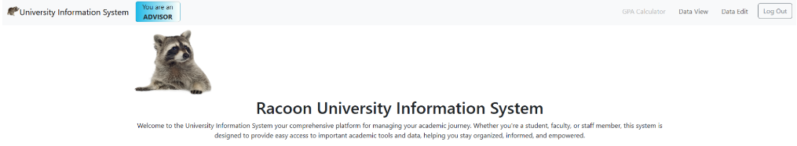

  

# 🎓 University Database System

> **Note:** This project contains only the **front-end GUI** — query functionality was implemented by a separate team.

---

## 🧾 Description

This web-based system was designed to manage **Student**, **Teacher**, **Course**, and **Administration** data within a university environment.  
It provides a user-friendly interface for interacting with a database through a graphical front end.

📄 Additional resources:
- **Presentation:** `University-Database-Presentation.pdf`  
- **System diagrams:** Located in the `System Diagrams` folder

---

## ✨ Features

- **Role-specific permissions:** Guest User, Staff, Instructor, Advisor, Student  
- **Login verification**  
- **GPA calculator tool** (includes future GPA estimation)  
- **Comprehensive data overview** using the *Data View Tool*  
- **Database table editing** via the *Data Edit Tool*  

---

## 👥 Student Team Members

This system was developed as a **Capstone Project** for the *Developer Operation Principles* course taught by **Dr. Sueychyun (Roger) Fang**.

- [@Sakib27](https://github.com/Sakib27)  
- [@GravityGravity](https://github.com/GravityGravity)  
- Unlisted Student Member 3  
- Unlisted Student Member 4 *(some students did not grant permission to be listed)*

---

## 🧩 Development Practices

The project emphasized real-world **DevOps** and **Agile** practices, including:
- Iterative sprint-based development  
- UML-standard **system diagrams**  
- Collaborative planning and **client-oriented feature design**

---

## ⚙️ Dependencies

| Component | Version |
|------------|----------|
| Operating System | Windows 10 |
| Code Editor | VS Code |
| React | ^18.0.27 |
| React DOM | ^18.0.10 |
| Vite React Plugin | ^3.1.0 |
| TypeScript | ^4.9.3 |
| Vite | ^4.1.0 |

---

